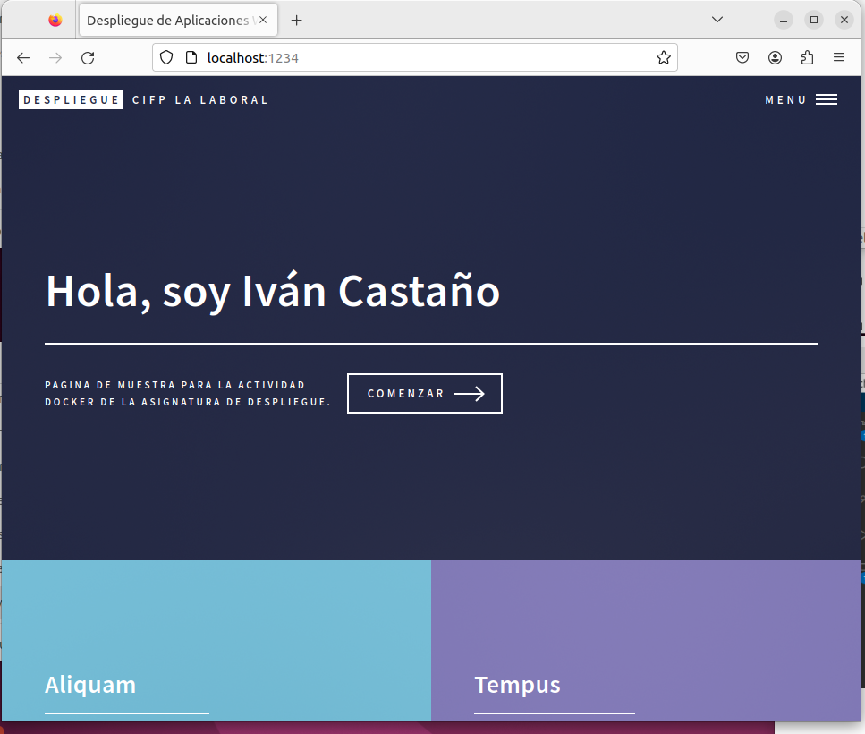
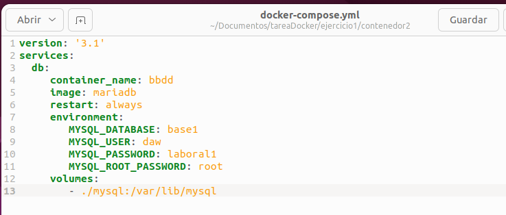

[TOC]

# 1.1 Servidor web


Arranco contenedor con una instancia de la imagen `php:7.4-apache`


Elimino el contenedor y creo un nuevo usando *bind mount* para montar mi propio directorio y que persistan los datos

```
ivan@ivan-clienteLinux:~$ docker run -d -p 1234:80 -v /home/ivan/Documentos/tareaDocker/ejercicio1/contenedor1:/var/www/html --name servidor php:7.4-apache
```


Coloco en el directorio raíz del servicio web un sitio web. Personalizo `index.html` con *Visual Studio Code*


Resultado:




Creo el archivo `cabeceras.php`  en el mismo directorio que contiene el `index.html` y muestro el resultado:


Detengo y borro el contenedor:

```
ivan@ivan-clienteLinux:~$ docker stop servidor
servidor
ivan@ivan-clienteLinux:~$ docker rm servidor
servidor
```


# 1.2 Servidor de base de datos


Descargamos la imagen de `mariadb`


Utilizo un fichero `docker-compose` para la creación y declaración de las variables de entorno requeridas en el enunciado




Ejecutamos el fichero


Accedemos a la consola del contenedor y muestro la base de datos


Me conecto como usuario *root* y creo la tabla *tabla1*


Muestro la tabla creada


Intento borrar la imagen `mariadb` y compruebo que no se permite mientras el contenedor está creado


Elimino y muestro que no hay ningún contenedor


