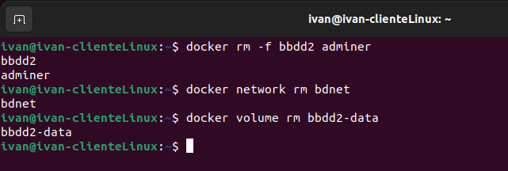

# 2 Redes y almacenamiento

## Despliegue de contenedores en red: Adminer y MariaDB

Creamos la red bridge `bdnet`

Creamos contenedor `mariaDB` en la red `bdnet`. Se ejecuta en segundo plano, accesible desde el puerto 3306. Definimos contraseña *root* y volumen de datos persistente

Creamos contenedor `Adminer` que se pueda conectar al contenedor de la base de datos

Utilizo `Adminer` para conectarme a la base de datos

Creo la base de datos *despliegue*

Muestro los datos generados por el contenedor de base de datos

Borrado de contenedores, red y volúmenes utlizados

