[TOC]

# 3 Imagen en Dockerfile

Arrancamos un contenedor basado en una imagen `php:7.4-apache`. Utilizo la plantilla del *ejercicio 1*

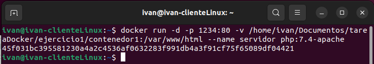

Entro en el terminal del contenedor y realizo modificaciones. En este caso, solo actualizaciones.

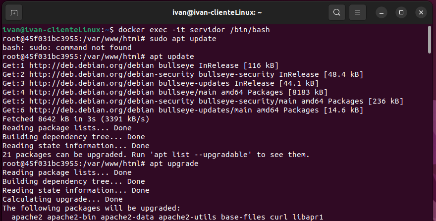

Accedo al sitio web desde el navegador

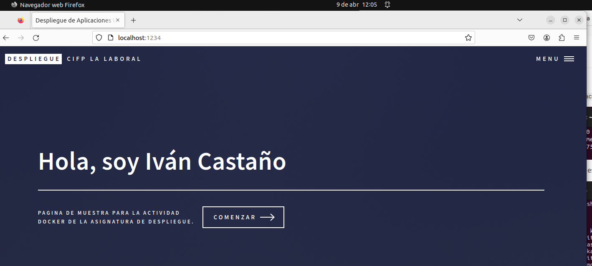

## Archivo Dockerfile y subida a DockerHub

Creamos un archivo `Dockerfile` con los parámetros necesarios para el despliegue de nuestra web

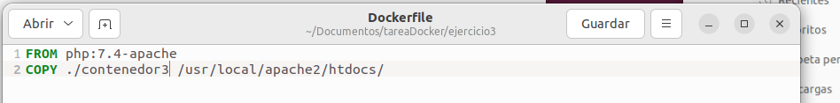

Creamos la imagen desde el directorio donde tenemos el `Dockerfile`

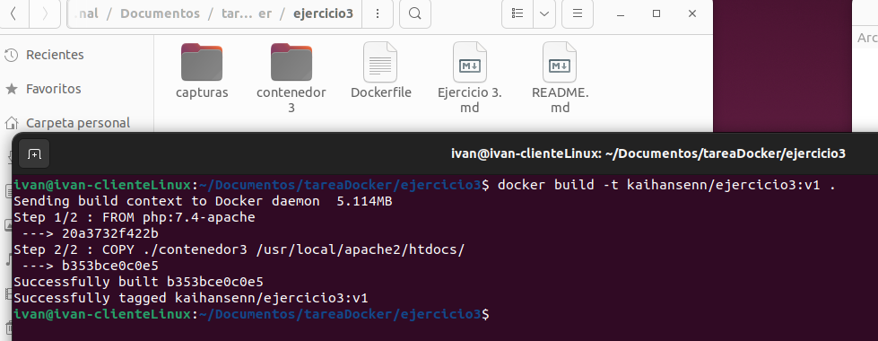

Muestro el contenido de la carpeta contenedor3, que contiene los ficheros del sitio web

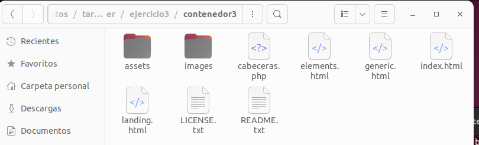

Compruebo que tengo la imagen que acabo de crear

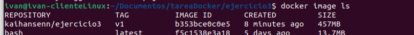

Inicio contenedor y ejecuto imagen que he creado

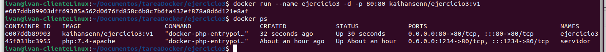

Distribuimos nuestra imagen

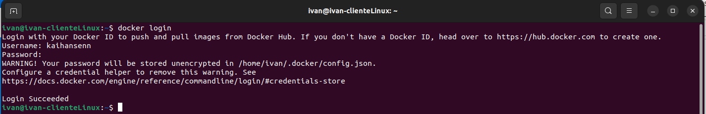

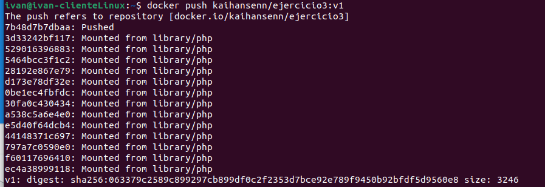

Imagen subida a DockerHub

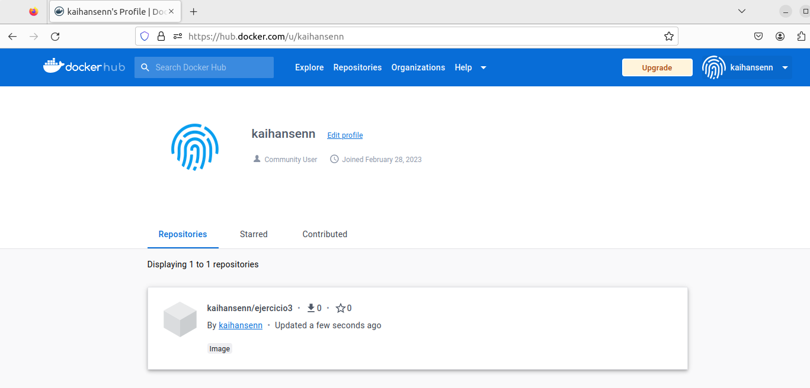

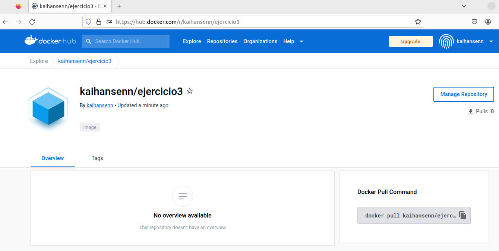
